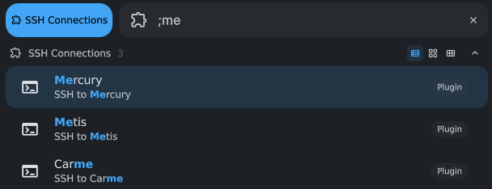
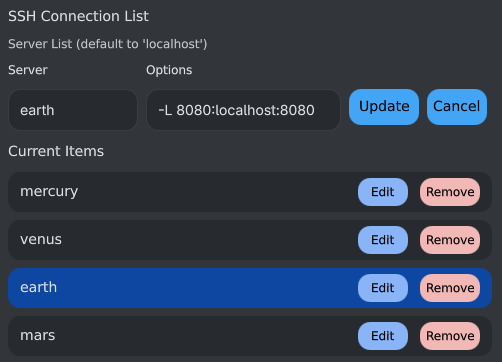

# SSH Connections

## Type: Launcher

## SSH to configured servers from the Launcher

This plugin allows for setting a list of SSH Servers and then connecting
to them through the Launcher.

## Implements a modified version of ListSettingWithInput

ServerList.qml is a modified version of ListSettingWithInput.
do_diff is a small script to see how divergent the two components are to
help keeping them in sync.

## Screenshot

## Repository Info

- **Repository Home**: https://git.erdelynet.com/mike/dms-plugins
- **Github Mirror**: https://github.com/merdely/dms-plugins
- **Issues**: https://github.com/merdely/dms-plugins/issues
- **Pull Requests**: https://github.com/merdely/dms-plugins/pulls

